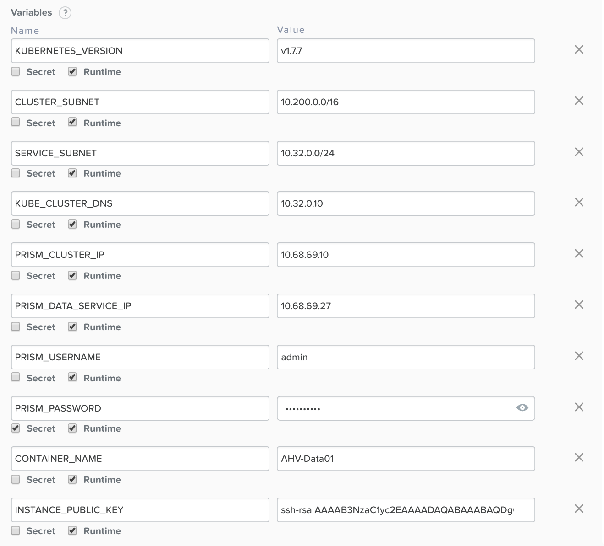
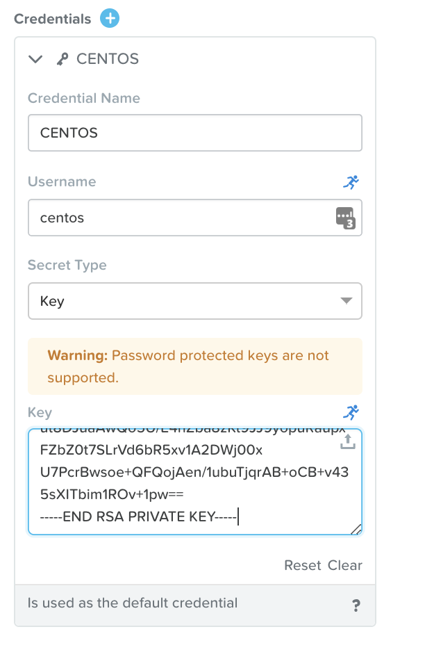
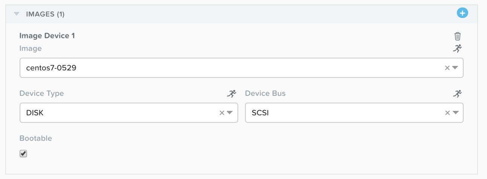
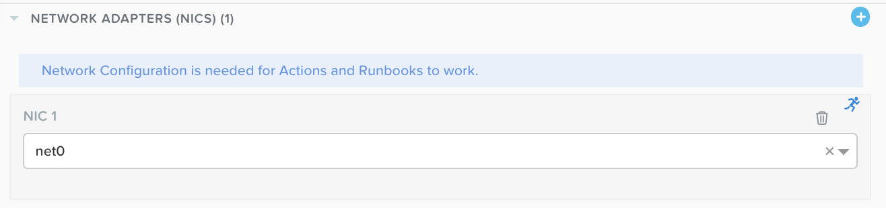
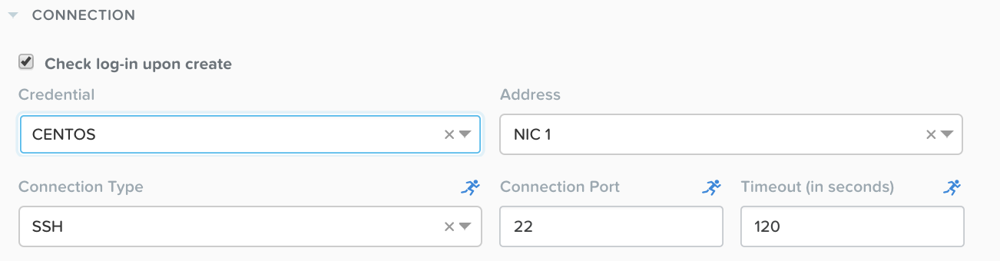
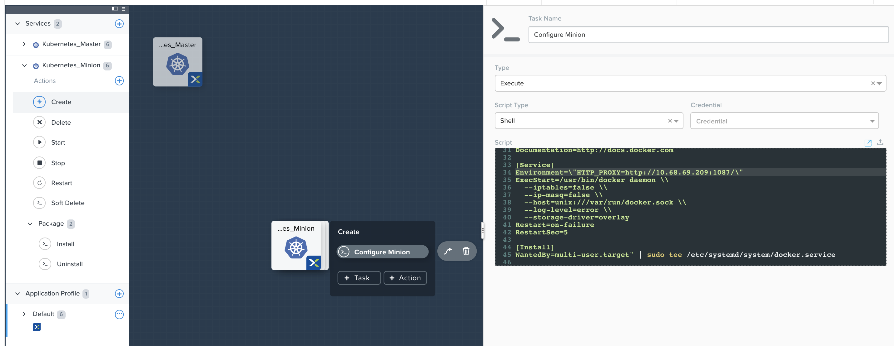
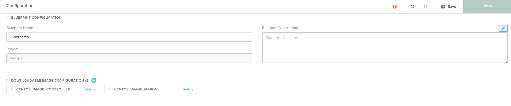
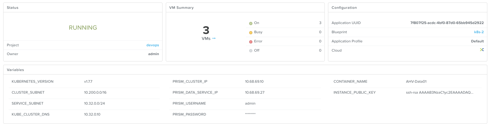

.. _calm_kubernetes_blueprint:

----------------
Calm: Kubernetes
----------------

Using Kubernetes BP v1.0.0
++++++++++++++++++++++++++

Variables
.........

Clone kubernetes blueprint v1.0.0 from market place to your project, 
edit variables to suite your environment.

    - CLUSTER_SUBNET -- pod network in kubernetes
    - SERVICE_SUBNET -- service network in kubernetes
    - KUBE_CLUSTER_DNS -- leave it default
    - PRISM_CLUSTER_IP / PRISM_DATA_SERVICE_IP -- nutanix cluster info
    - PRISM_USERNAME / PRISM_PASSWORD -- credentials for nutanix prism
    - CONTAINER_NAME -- where your VMs will located in
    - INSTANCE_PUBLIC_KEY -- public key for user who will login VM to execute all tasks

Credentials
...........

Edit default user, add private key to CENTOS.
This user will be created with cloud-init script and transfer public key to authorized_keys file (see images above)
you need put the private key in here (see image below) 

Service
.......

this image is based on default nutanix image (http://download.nutanix.com/calm/CentOS-7-x86_64-GenericCloud.qcow2). 
I just download some packages i needed first due to network issue in China.

Choose a network with IPAM enabled or has DHCP server in that segment

Choose default user for login check-in

Task
....

Edit task in minion (K8SM)

- comment all wget packages due to we have download them in advance

- add environment to docker system script, to ensure download images through proxy, especially when your demo environment in C_H_I_N_A

.. code-block:: bash

    Environment=\"HTTP_PROXY=http://10.132.71.38:1080/\"

Edit task in controller (K8SC)

- comment all wget packages due to we have download them in advance

Other
.....

Launch
......

Using Kubernetes BP v2.0.0
++++++++++++++++++++++++++

- clone k8s 2.0 blueprint to your project
- update variable public key 
- update credentials
- download some file to local and create customized image due to network limitation in some region
- comment curl line in 'package install' task (master & minion)
- update vm image (master & minion)
- update vm nic (master & minion)
- add environemnt to docker service (master & minion)

.. code-block:: bash
    sudo sed -i '/ExecStart=/c\\ExecStart=/usr/bin/dockerd -H tcp://0.0.0.0:2375 -H unix:///var/run/docker.sock' /usr/lib/systemd/system/docker.service
    cp /usr/lib/systemd/system/docker.service /tmp
    sudo sed -i '/\[Service\]/c\\[Service]\nEnvironment=\"HTTP_PROXY=http://10.132.71.38:1080/\"' /usr/lib/systemd/system/docker.service

.. figure:: images/kube-1.10.5-1.png

- add more waiting time (line 22), due to download through proxy is slower than normal.

.. figure:: images/kube-1.10.5-2.png

- update HELM script, add using http proxy when helm init

.. code-block:: bash
    printf -v no_proxy '%s,' 10.132.{250..251}.{1..255}
    export no_proxy=${no_proxy}localhost
    echo $no_proxy
    http_proxy=http://10.132.71.38:1080/ no_proxy=${no_proxy} helm init --service-account helm

.. figure:: images/kube-1.10.5-3.png

- login to controller0 to execute ``kubectl``

